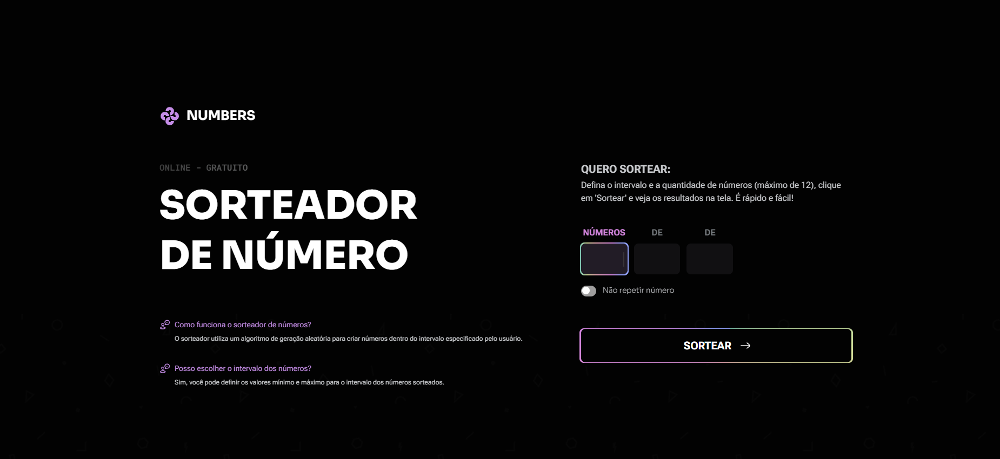

🎲 Sorteador de Números 

Este projeto é um sorteador de números personalizado, desenvolvido como desafio da Rocketseat. O usuário pode definir a quantidade de números e o intervalo mínimo e máximo para o sorteio, recebendo o resultado na tela de forma simples e interativa.

🔍 Visão Geral

O sistema permite que o usuário:

Defina quantos números deseja sortear.

Escolha o intervalo mínimo e máximo.

Receba o resultado na tela de forma clara.

Veja feedback caso insira valores inválidos.

Execute novos sorteios sem precisar recarregar a página.

## ✨ Funcionalidades

- Entrada para quantidade de números a serem sorteados

- Definição de número inicial e final do intervalo

- Sorteio sem repetição (opcional)

- Exibição dos resultados na tela

- Bloqueio para impedir sorteios inválidos

- Layout responsivo

## 🛠 Tecnologias utilizadas

- HTML5
- CSS3
- JavaScript

## 🎯 Aprendizados

- Gerar números aleatórios em JavaScript
- Criar sorteios sem repetição de valores
- Validar entradas do usuário
- Manipular o DOM para mostrar resultados
- Aplicar boas práticas na estrutura do código

## 🌐 Acesse o projeto online

🔗 [Clique aqui para visualizar](kauasilvandrade.github.io/numberPicker/);

## 📸 Imagem do projeto

## 📌 Status do projeto

✅ Projeto finalizado e publicado.

## ✍️ Autor

**Kauã da Silva Andrade**  
[LinkedIn](https://www.linkedin.com/in/kauã-andrade)  
[GitHub](https://github.com/kauasilvandrade)